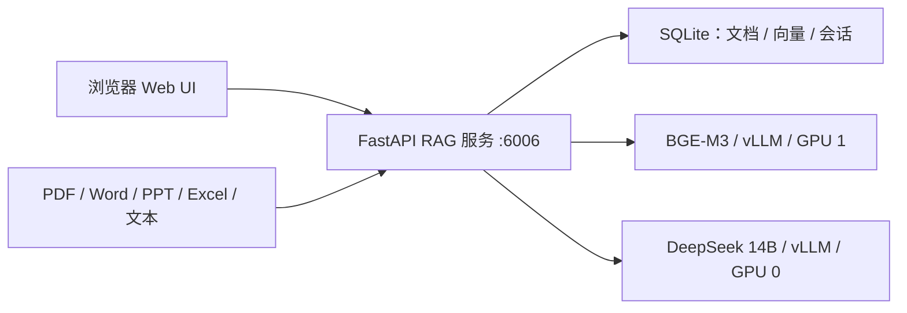

# DeepSeek RAG 知识库

这是在原始 `rag-project` 基础上补全的可运行版本。项目不再依赖缺失的 `server.chat`、智谱 API 或 MySQL，默认在 GPU 服务器上运行本地 DeepSeek 与本地中文嵌入模型。

## 功能

- 本地 `DeepSeek-R1-Distill-Qwen-14B`，通过 vLLM 提供流式 OpenAI 兼容接口。
- 本地 `BAAI/bge-m3` 中文/多语言向量嵌入，通过 vLLM Embeddings API 提供 GPU 推理。
- PDF、DOCX、PPTX、XLSX、CSV、Markdown、HTML、TXT 上传与解析。
- 中文/英文分词、停用词过滤、英文词形归一、实体识别与关键词提取。
- 原问题 BGE-M3 语义召回 + BM25 词法召回 + 实体命中加权的混合排序；页面展示完整查询理解和分项分数。
- 检索增强问答、原文片段、文件名、页码/幻灯片/工作表位置与相关度引用。
- 会话、消息、文档元数据、文本切片和向量全部持久化到 SQLite。
- 流式 SSE 输出、DeepSeek 推理过程折叠显示、会话历史与文档管理。
- 健康检查、自动化测试、Docker Compose 和远程部署脚本。

## 架构



问答流程：上传文件 → 提取结构和位置 → 中文切片 → BGE-M3 向量化并建立词法索引 → SQLite 保存 → 查询理解 → BGE-M3 + BM25 + 实体加权混合检索 → 携带资料与会话历史调用 DeepSeek → 流式回答和引用。

停用词和词形归一只用于 BM25 词法支路；原问题始终完整送入 BGE-M3。这样既减少“的、了、是”等高频词对精确匹配的干扰，又不会因删词而损失上下文语义。英文使用 Snowball stemming；中文没有强行套用英文词干算法。

## g90 一键部署

要求：Docker、Docker Compose、NVIDIA 驱动和 NVIDIA Container Runtime。默认使用 GPU 0 运行 DeepSeek，GPU 1 运行 BGE-M3。部署文件支持 `docker compose` 和独立的 `docker-compose` 命令；g90 使用服务器已有的 vLLM 镜像，并通过 `hf-mirror.com` 下载模型。

```bash
cd ~/apps/deepseek-rag
cp .env.example .env
bash scripts/remote_deploy.sh
```

本次 g90 部署发现宿主机 `6006` 已被其他任务占用，因此 `.env` 使用 `RAG_PORT=6016`，实际地址是 `http://11.11.33.2:6016`；容器内部仍为 `6006`。

首次运行会下载约 30GB 的 DeepSeek 权重和 BGE-M3 权重。g90 无法直连 Docker Hub，因此部署时使用服务器已有的 vLLM/ModelScope 镜像，并把模型下载到 `model-cache/modelscope/` 后从本地目录加载。查看进度：

```bash
docker-compose logs -f llm embeddings
```

查看状态：

```bash
docker-compose ps
curl http://127.0.0.1:6016/api/health
```

重启、停止与更新：

```bash
docker-compose restart
docker-compose stop
docker-compose up -d --build
```

如果不能直接访问服务器端口，可在本机建立 SSH 隧道：

```bash
ssh -L 6016:127.0.0.1:6016 g90
```

然后打开 `http://127.0.0.1:6016`。

## 本地开发

本机只验证业务流程时，可以使用无模型、无 GPU 的确定性测试模式：

```powershell
uv venv --python 3.12 .venv
uv pip install --python .venv\Scripts\python.exe -r requirements-test.txt
$env:RAG_EMBEDDING_MODE="hash"
$env:RAG_LLM_MODE="mock"
python startup.py
```

运行测试：

```bash
python -m pytest -q
```

生产环境不要启用 `mock/hash`；Docker Compose 已配置为连接两个本地 vLLM 服务（DeepSeek 生成与 BGE-M3 嵌入）。

## 配置

| 环境变量 | 默认值 | 说明 |
|---|---:|---|
| `RAG_PORT` | `6006` | Web 对外端口 |
| `LLM_GPU` | `0` | DeepSeek 使用的 GPU |
| `EMBEDDING_GPU` | `1` | BGE-M3 使用的 GPU |
| `RAG_TOP_K` | `6` | 默认召回切片数 |
| `RAG_SCORE_THRESHOLD` | `0.20` | 余弦相似度最低阈值 |
| `RAG_MAX_UPLOAD_MB` | `50` | 单文件最大大小 |
| `RAG_CHUNK_SIZE` | `700` | 切片字符数 |
| `RAG_CHUNK_OVERLAP` | `100` | 相邻切片重叠字符数 |
| `RAG_MAX_CONTEXT_CHARS` | `12000` | 注入模型的资料字符上限 |
| `RAG_SYSTEM_PROMPT` | 内置中文提示词 | 自定义系统提示词 |

应用层还支持任意 OpenAI 兼容模型服务：设置 `RAG_LLM_BASE_URL`、`RAG_LLM_MODEL` 和 `RAG_LLM_API_KEY` 即可。默认部署不需要 API Key，也不会调用智谱。

## API

- `GET /api/health`：LLM、嵌入和数据库健康状态。
- `GET /api/config`：前端可公开配置。
- `GET /api/stats`：文档、切片和会话统计。
- `POST /api/analyze`：查看分词、停用词、词形归一、实体、关键词和语义检索策略。
- `POST /api/documents`：上传并同步解析、切片、向量化。
- `GET /api/documents` / `DELETE /api/documents/{id}`：文档管理。
- `POST /api/chat`：SSE 流式 RAG 问答。
- `POST /api/conversations`：创建会话。
- `GET /api/conversations`：会话列表。
- `GET /api/conversations/{id}/messages`：会话消息。
- `PATCH /api/conversations/{id}` / `DELETE /api/conversations/{id}`：重命名或删除会话。
- `GET /docs`：FastAPI OpenAPI 文档。

## 数据目录

运行数据保存在 `runtime/`：

- `runtime/rag.sqlite3`：元数据、文本、向量、会话和消息。
- `runtime/uploads/`：上传的原始文件。
- `model-cache/`：Hugging Face 模型缓存。

备份时停止应用或使用 SQLite 在线备份后，保存 `runtime/` 即可。模型缓存可以重新下载，不属于业务数据。

## 已知边界

- 扫描版 PDF 当前不会自动 OCR，需要先转换为可复制文本的 PDF。
- SQLite 向量扫描适合个人/小团队知识库；达到几十万切片后建议替换为 Qdrant、Milvus 或 pgvector。
- 当前默认无登录鉴权，适合受控内网。若暴露到公网，应在前面增加 HTTPS、身份认证和访问控制。

### ModelScope tokenizer 兼容修正

ModelScope 镜像中的 DeepSeek R1 Distill Qwen `tokenizer_config.json` 将 Qwen2 BPE 误标为 `LlamaTokenizerFast`。在新版 Transformers/vLLM 中，这会导致中文无法编码并流出 `Ġ/Ċ` 原始 token。部署脚本会在下载完成后自动运行 `scripts/fix_deepseek_tokenizer.py`，改为 `Qwen2TokenizerFast`；该修正不改动模型权重。
